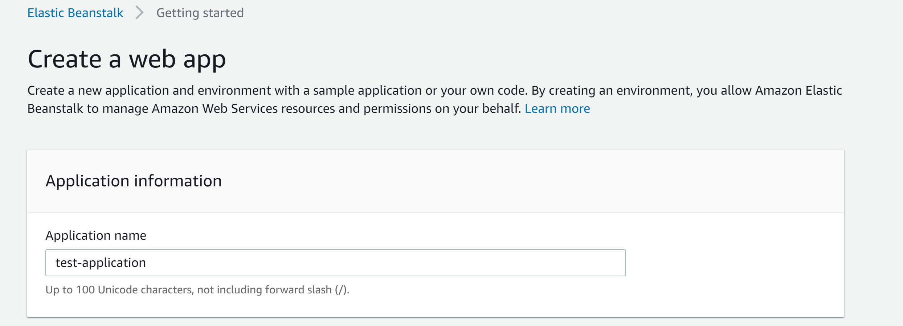
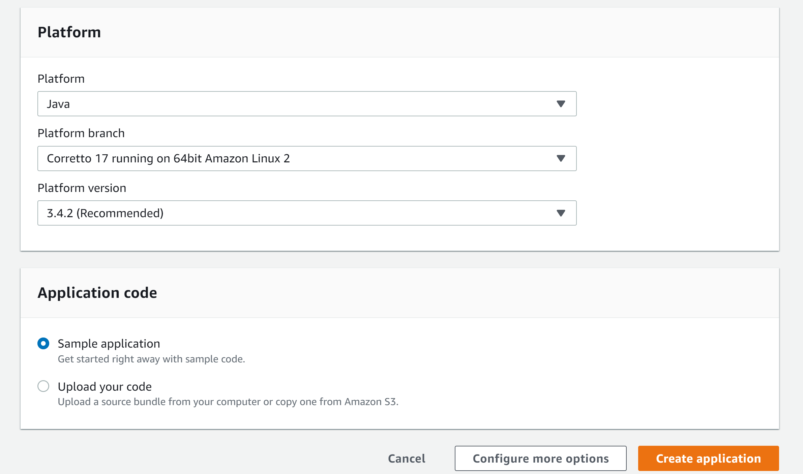
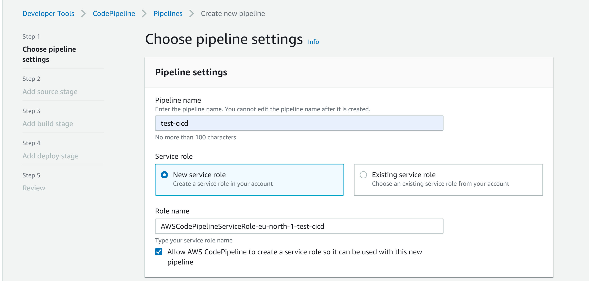
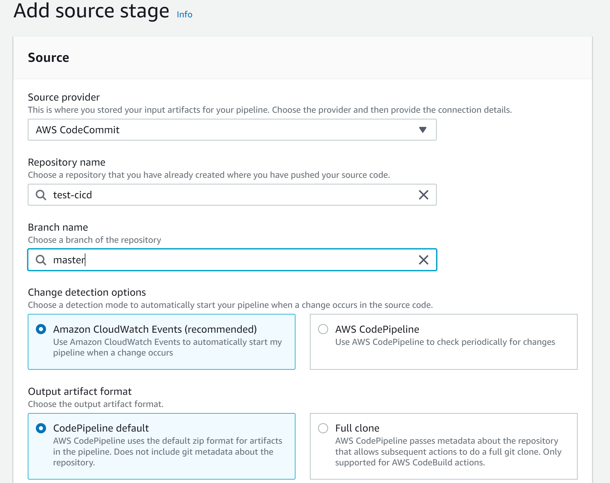
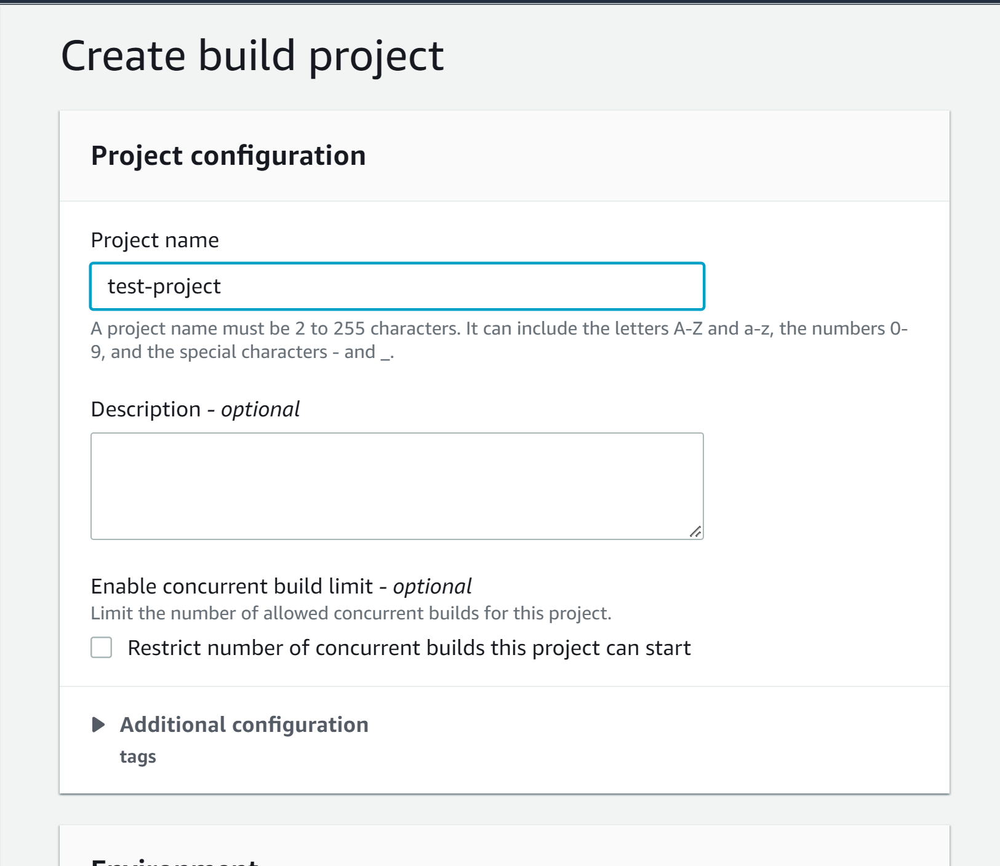
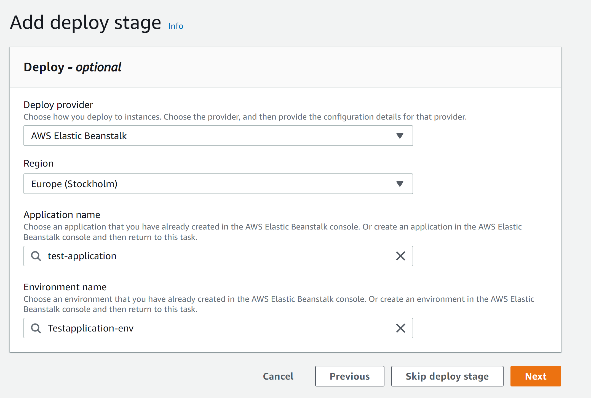
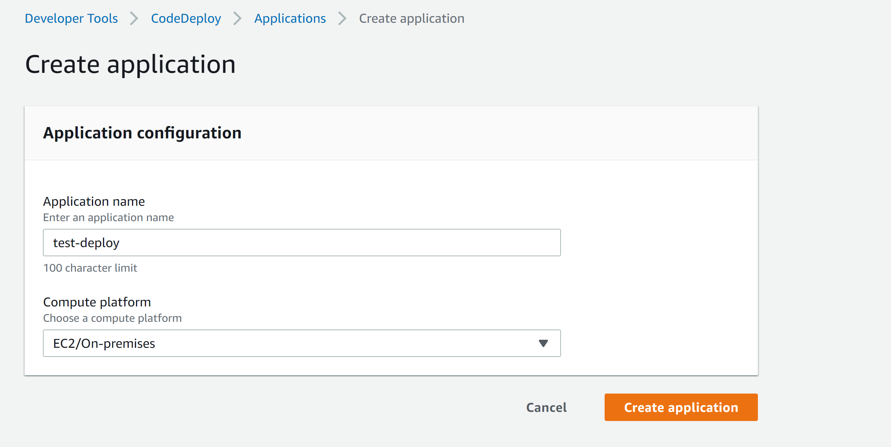
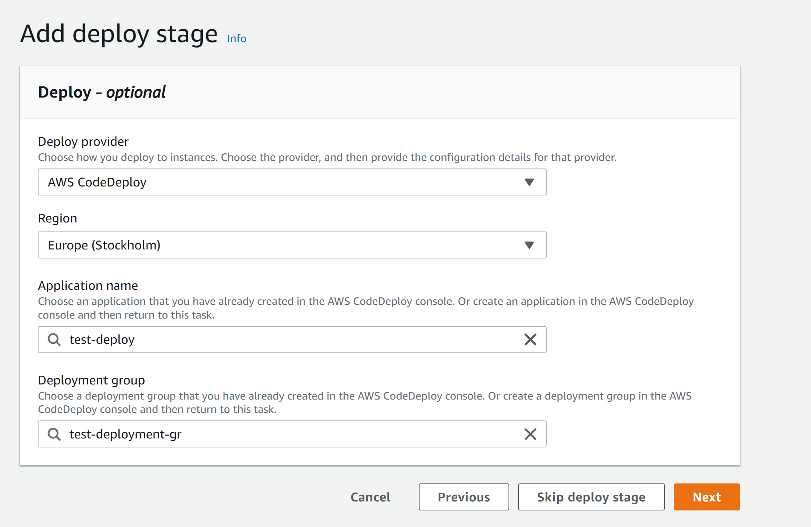

How to create cicd ws beanstalk:

NOTE: get credentials in IAM for codecommit

First we need to create beansalk itself, for this just navigate in AWS  for Beanstalk and create application:


And in a few minutes its done

Now lets move to our pipeline, navigate to CodePipeline and create new pipeline

As a source we will choose codecommit as it's our provider and the repository we just created

For build part we added buildspec.yml file in our repository, so lets configure build step



For environment we may use just Ubuntu 

We could create buildspec right here, but we already have it, so just go on


And deploy to our beanstalk environment


And after all this just run our pipeline and thats it :)


For scenario with simle EC2:

NOTE: Unlike with beanstalk, here all we have is a clear Ubuntu, 
so we have to install codedeploy  agen and specify appspec.yml for deployment process with deployment scripts

* First create role for ec2 and ec2 as before:
Open the IAM console at https://console.aws.amazon.com/iam/).

* From the console dashboard, choose Roles.

* Choose Create role.

* Under Select type of trusted entity, select AWS service. Under Choose a use case, select EC2. Under Select your use case, choose EC2. Choose Next: Permissions.

* Search for and select the policy named AmazonEC2RoleforAWSCodeDeploy.

* Search for and select the policy named AmazonSSMManagedInstanceCore. Choose Next: Tags.

* Choose Next: Review. Enter a name for the role (for example, EC2InstanceRole).

Connect to ec2 instance as before and install codedeploy agent there:
On Ubuntu Server 14.04, enter the following commands, one after the other:

```
sudo apt-get update

sudo apt-get install ruby2.0

sudo apt-get install wget
```

On Ubuntu Server 16.04 and later, enter the following commands, one after the other:
```
sudo apt update

sudo apt install ruby-full

sudo apt install wget
```

Enter the following command:

```

wget https://bucket-name.s3.region-identifier.amazonaws.com/latest/install
```
aws-codedeploy-us-east-2 for instances in the US East (Ohio) region etc...

Enter the following command:

```
chmod +x ./install
```

To install the latest version of the CodeDeploy agent on Ubuntu 14.04, 16.04, and 18.04:

```
sudo ./install auto
```
To install the latest version of the CodeDeploy agent on Ubuntu 20.04:
```
sudo ./install auto > /tmp/logfile
```

To check that the service is running

Enter the following command:

```
sudo service codedeploy-agent status
```
If the CodeDeploy agent is installed and running, you should see a message like The AWS CodeDeploy agent is running.

If you see a message like error: No AWS CodeDeploy agent running, start the service and run the following two commands, one at a time:

```
sudo service codedeploy-agent start

sudo service codedeploy-agent status
```

Then, create role for codedeploy:

* Open the IAM console at https://console.aws.amazon.com/iam/).

* From the console dashboard, choose Roles.

* Choose Create role.

* Under Select trusted entity, choose AWS service. Under Use case, choose CodeDeploy. Choose CodeDeploy from the options listed. Choose Next. The AWSCodeDeployRole managed policy is already attached to the role.

* Choose Next.

* Enter a name for the role (for example, CodeDeployRole), and then choose Create role.

Then create aplication in codeDeploy:

* Open the CodeDeploy console at https://console.aws.amazon.com/codedeploy.

* If the Applications page does not appear, on the menu, choose Applications.

* Choose Create application.

* In Application name, enter name of our application.

* In Compute Platform, choose EC2/On-premises.

* Choose Create application.




After this create a deployment group:

* On the page that displays your application, choose Create deployment group.

* In Deployment group name, enter MyDemoDeploymentGroup.

* In Service role, choose the service role you created earlier (for example, CodeDeployRole).

* Under Deployment type, choose In-place.

* Under Environment configuration, choose Amazon EC2 Instances. In the Key field, enter Name. In the Value field, enter the name you used to tag the instance (for example, MyCodePipelineDemo).

* Under Agent configuration with AWS Systems Manager, choose Now and schedule updates. This installs the agent on the instance. The Linux instance is already configured with the SSM agent and will now be updated with the CodeDeploy agent.

* Under Deployment configuration, choose CodeDeployDefault.OneAtaTime.

* Under Load Balancer, make sure Enable load balancing is not selected. You do not need to set up a load balancer or choose a target group for this example.

* Choose Create deployment group.


Now just setup the pipeline just like before, except for codedeploy step:


And after run pipeline everything shoukd be ok
