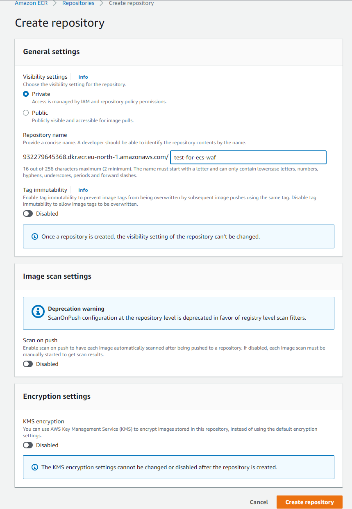
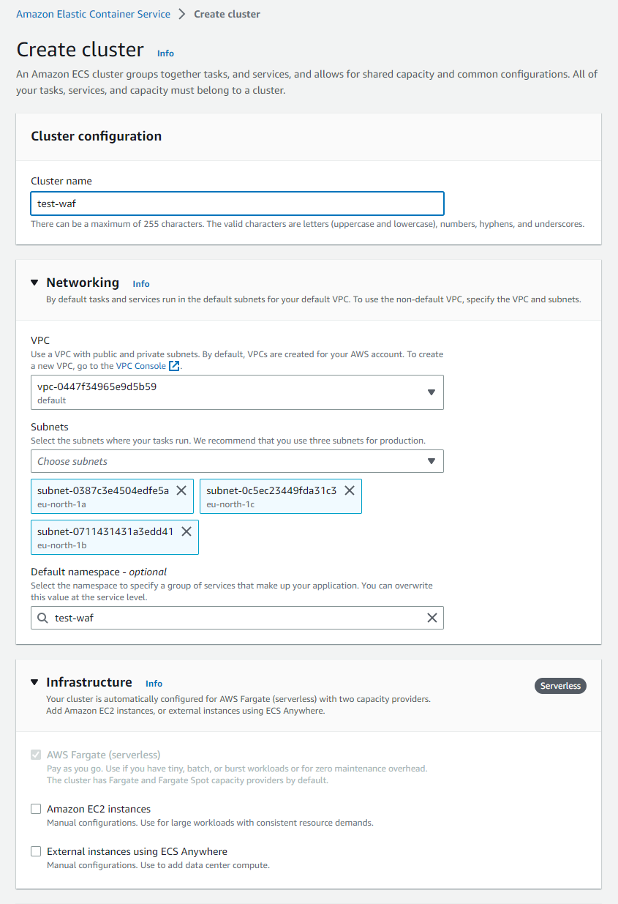
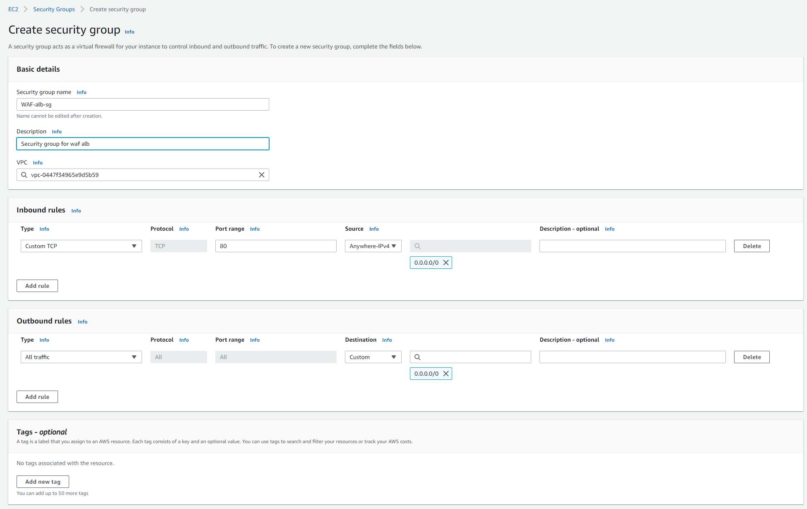
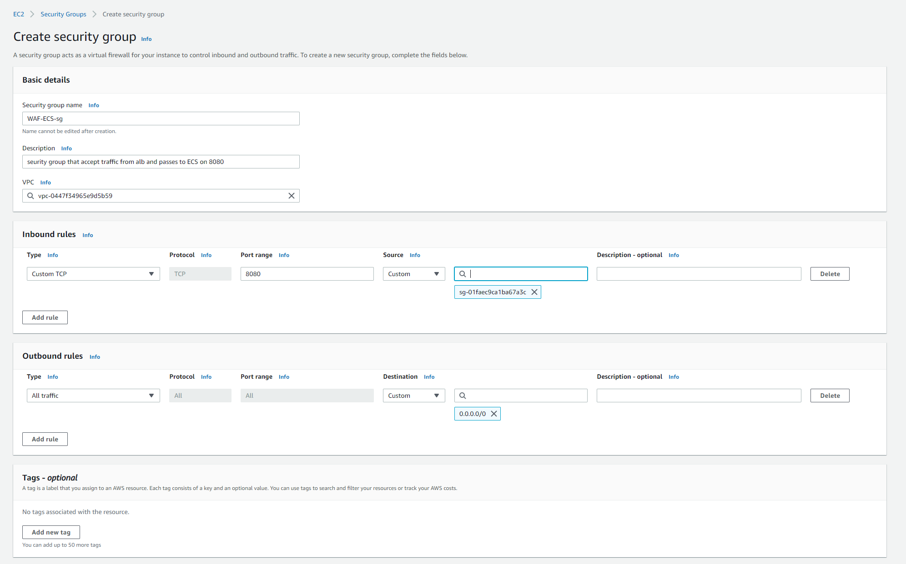
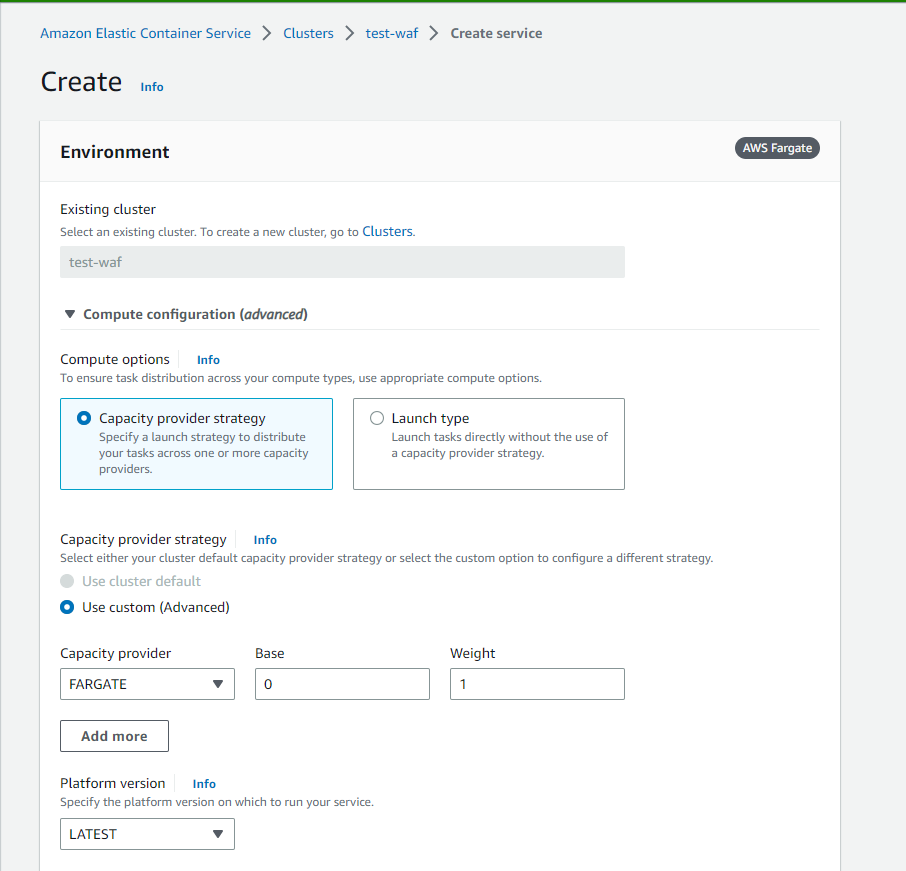
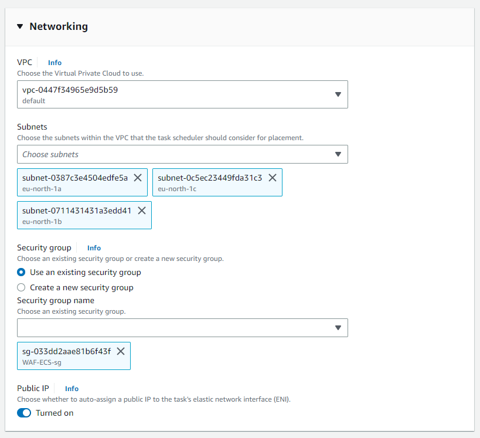
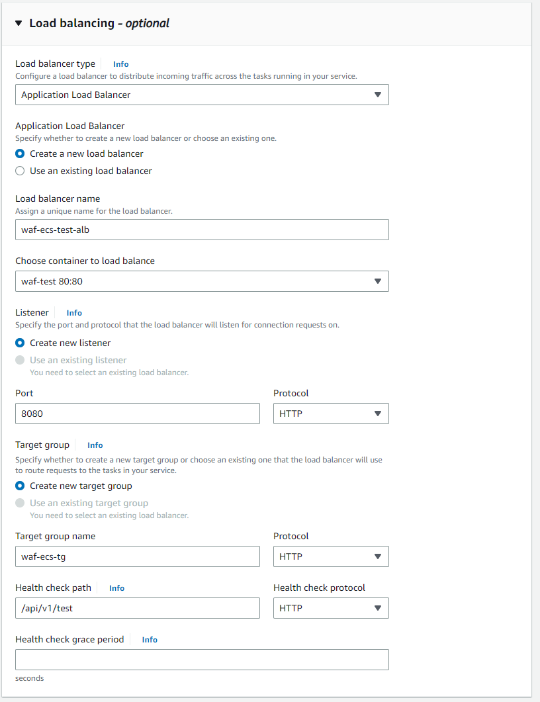

#How to set up ECS + ECR + ALB + WAF and test via k6

!NOTE: for this you need docker to be installed on your machine!

First we can create ECR repository

Then we can see push commands to build and push our image:

Once its done, we may see our image in ECR:

Now lets navigate to ECS and create cluster

!NOTE: here we will use default vpc!

Next we should create a task definition:

As image URI use tha URI from ECR with tag (latest is for the latest version)

Next configure env for fargate:

Rest of configurations may be left as they are

!NOTE: here we have a second revision, but you will have the first one!

Now lets work with our security groups
This one represents security group for our loadbalancer

And this one accepts traffic from alb and passes to ECS on 8080

Next navigate to cluster and create service to run our fargate:

In network choose our security group:

And create Load balancer right here:

And after a few minutes we can see our service and our task in Running status in cluster console:

In alb console add our security group:

Than pass our loadbalancer dns in url with our request uri and thats it:

Now lets create WAF as before and name it ecs-alb-waf:

But this time lets block everything that not ends with "test"

And now we have HTTP 403 which is default WAF code:

Even in case that we dont have such endpoint:

Now lets test it via [k6](../../k6/K6.md):

This is with the correct url that not blocked with WAF:

Now lets create wrong URL:

And thats will be our output:

As well as our log insights:
